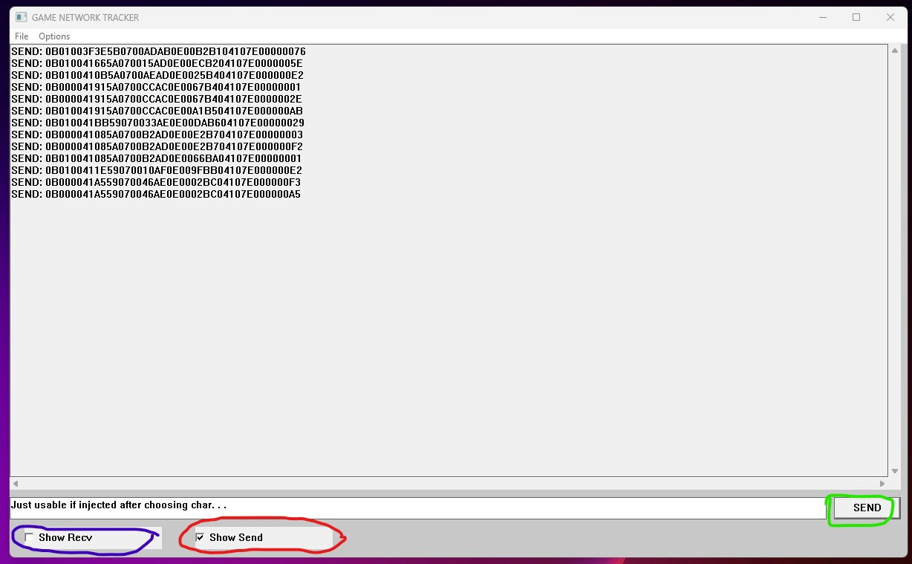

# game_net_analyzer
Welcome to the Game Network Analyzer repository! This program has been developed with the primary objective of enhancing our understanding of reverse engineering, without any intention of disrupting the gaming experience for others. Here's an overview of the key functionalities it offers:
* Intercept and analyze packets sent from the game client to the server before encryption.
* Intercept and inspect packets sent from the server to the client after decryption.
* Filter packets based on your preferences.
* Send customized packets.
* Utilize a user-friendly graphical interface to systematically analyze packet structures.

## Demo
Here's a demo showcasing the end result, where every action in the game results in a packet being sent from the client to the server:


## Why?
In today's gaming landscape, many games demand extensive access to a user's operating system, sometimes even exceeding the user's own control by running parts within the kernel. It's disconcerting to observe how games are installed on our computers, where I grant them extensive permissions without fully comprehending the data they may be sending to their game servers. As a response to this situation, I choosed an older game with less stringent defense mechanisms (due to our relative newness in this area a few months ago) and embarked on a journey to understand how the client communicates with the game server.

## How?
Our exploration revealed that nearly every communication between a Windows application and a network protocol eventually passes through the WS_32 module, specifically the WS_32.send and WS_32.recv functions. However, it became evident that the game client encrypts packets at these points. To circumvent this encryption, I traced the process back to the point where packets were stored in computer registers without encryption. I referred to the responsible functions as "internal send" and "internal recv" functions and created a detour routine within our own program. It's worth noting that editing another computer program's code in a Windows environment is not straightforward. Therefore, I devised a method to inject a Dynamic Link Library (DLL) into the target process. The injection process, detailed in main.cpp, utilized a DLL named evil.cpp. Once injected, this DLL was able to share the same address space as the target process. This approach required us to work closely with system language, which is why I chose the combination of C++ and x86 ASM.

## GUI
The program features a straightforward GUI, with a large textbox displaying the packets being sent. The blue checkbox activates tracking of packets coming from the server to the client, while the red checkbox tracks packets going from the client to the server. The green-bordered button allows you to send your own bytecode for debugging purposes:


## Packet Structure
As seen in the previous screenshot, each packet consists of a series of bytes. For example, movement packets might look like this:
```
0B 00 00 41 A5 59 07 00 46 AE 0E 00 02 BC 04 10 7E 00 00 00 A5
```
I've observed that the first byte typically indicates the packet type or the overall function triggered, such as movement, item usage, or attacks. Repeatedly performing the same in-game action with slight parameter variations can help decipher the meaning of each byte in the sent packets.

## Disclaimer
Using the data acquired by this program to gain an advantage in the game can result in a ban from the game. I do not take responsibility for any such consequences. Our program is solely intended for observational purposes.

## Future
After dedicating approximately half a year to this project and related endeavors, I currently have no specific plans for its future. I am delighted to share it here with the community and welcome any ideas or suggestions for improvements. Your insights can contribute to enhancing the program's capabilities and usability.
